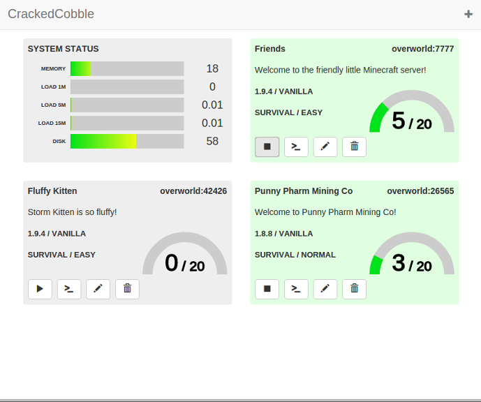

# CrackedCobble

CrackedCobble is a Minecraft server instance manager.  It is a web-based application that consists of a client
application and a server application (using node.js).  The server application runs on the Minecraft instance server and
serves the client application to user's web browsers and/or mobile devices.  The main user interface is a
mobile-friendly dashboard web application.  The dashboard provides a visual status indication of the Minecraft server
instances and provides simple start/stop control.

## Current version

**CrackedCobble does not yet have a "released" version**

## Currently available features

* Status monitoring of Minecraft server instances (vanilla-only)
* Start/stop control of Minecraft server instances (vanilla-only)
* Status monitoring of server health (CPU load, memory usage, disk usage, etc.)
* Minecraft server instance creation (vanilla)
* Interactive console for a server instance launched from dashboard (for entering server op commands, etc.)

## Planned features

* Minecraft server instance creation with automatic mod installation (forge-based)
* Server instance modification
* Map/world reset option
* Ability to create server with specified map

## Installation

Installation instructions will be provided when the project reaches a "released" version stage.

## Screenshots

Desktop Dashboard

Mobile Dashboard

## Disclaimer

This project is a third-party created application and is in no way affiliated with or endorsed by Minecraft or Mojang.
